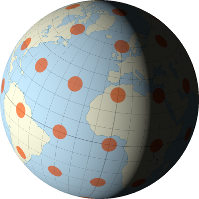
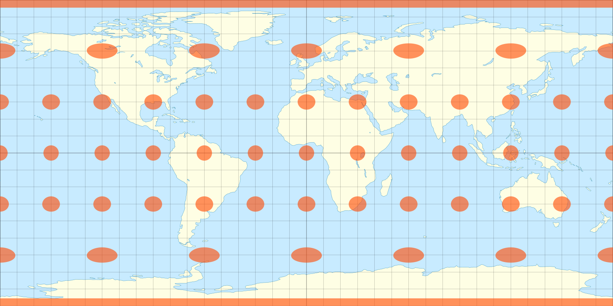

# WebGPU for Python

Small programs created with WebGPU for Python

[wgpu-py](https://github.com/pygfx/wgpu-py)<br>
[pyshader](https://github.com/pygfx/pyshader)

```bash
pip install wgpu     # version 0.3.0
pip install pyshader # version 0.7.0
```

## [globe.py](globe.py)

Rotating world globe with basic shading.



Qt5 is used for on screen display and PIL to load the texture.
Tested with Python version 3.9.1.
```bash
pip install PyQt5  # version 5.15.2
pip install Pillow # version 8.1.0
```

The shader will generate the orthographic projection of an equirectangular map.
The following map is used as an example:

[](https://upload.wikimedia.org/wikipedia/commons/1/17/Plate_Carrée_with_Tissot%27s_Indicatrices_of_Distortion.svg)

[Justin Kunimune](https://github.com/jkunimune15/Map-Projections),
CC BY-SA 4.0 <https://creativecommons.org/licenses/by-sa/4.0>,
via Wikimedia Commons

Based on the
[triangle.py](https://github.com/pygfx/wgpu-py/blob/master/examples/triangle.py)
example, with the help of
[WGPU API](https://wgpu-py.readthedocs.io/en/stable/reference_wgpu.html),
[001 : A Triangle : WebGL 2 WebGPU](https://www.youtube.com/watch?v=nLe4QMieQYs)
and
[Cube WebGPU Example](https://github.com/tsherif/webgpu-examples/blob/gh-pages/cube-texture-lighting.html)